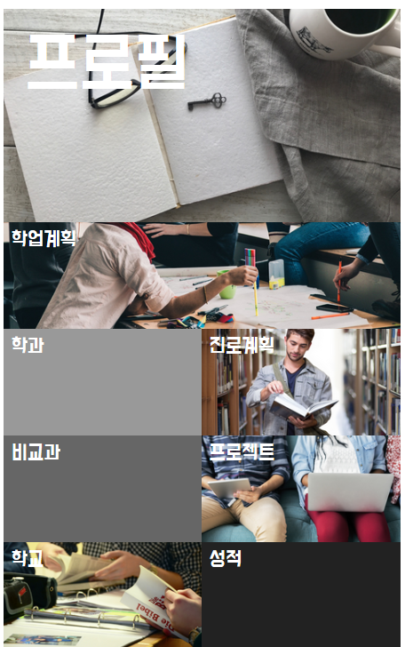
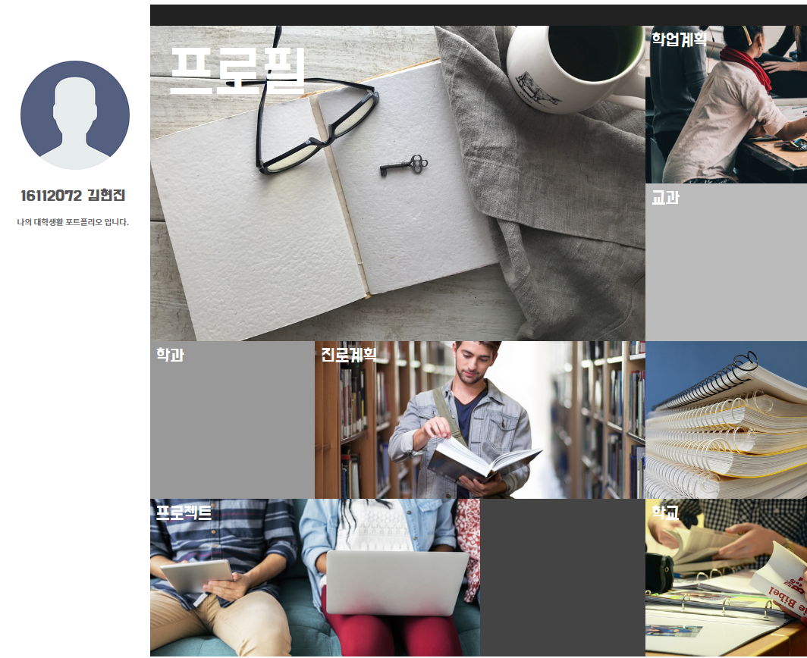
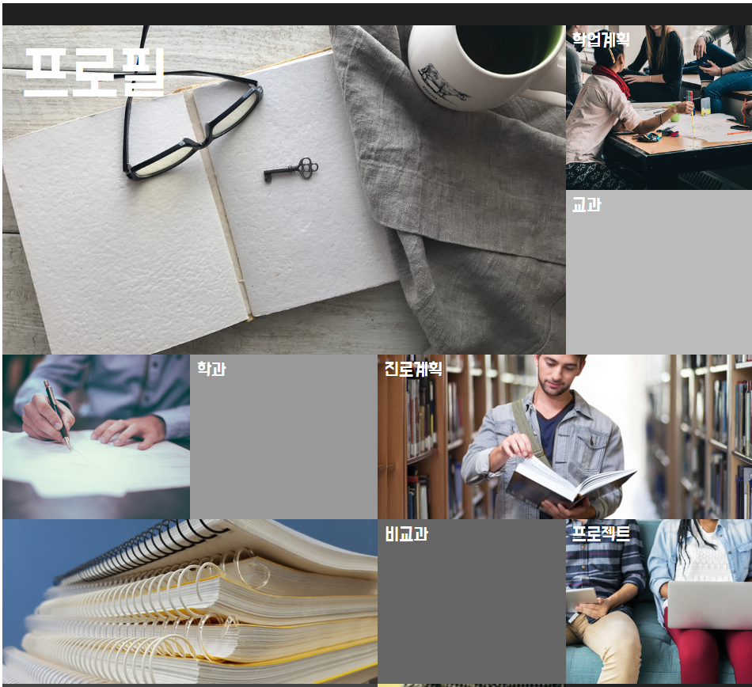
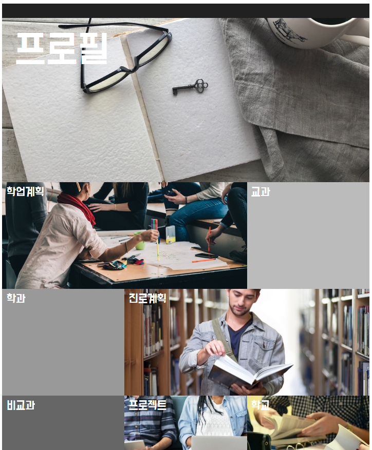

# 대학생활 포트폴리오를 주제로한 반응형 WEB PAGE

## 1. 개요

HTML/CSS 를 활용한 WEB PAGE 입니다.  
나의 대학생활 포트폴리오라는 주제의, 화면 크기에 맞게 레이아웃이 적절히 배치되는 반응형 web page입니다.
 
 

## 2. 사용 언어 및 도구

- HTML
- CSS
- eclipse

 
 

## 3. 실행 이미지

 
 

## 4. 보안해야할 점

- HTML/CSS, 반응형 기능 구현에만 집중했기 때문에 메뉴를 클릭 시 action이 작동하지 않습니다.
